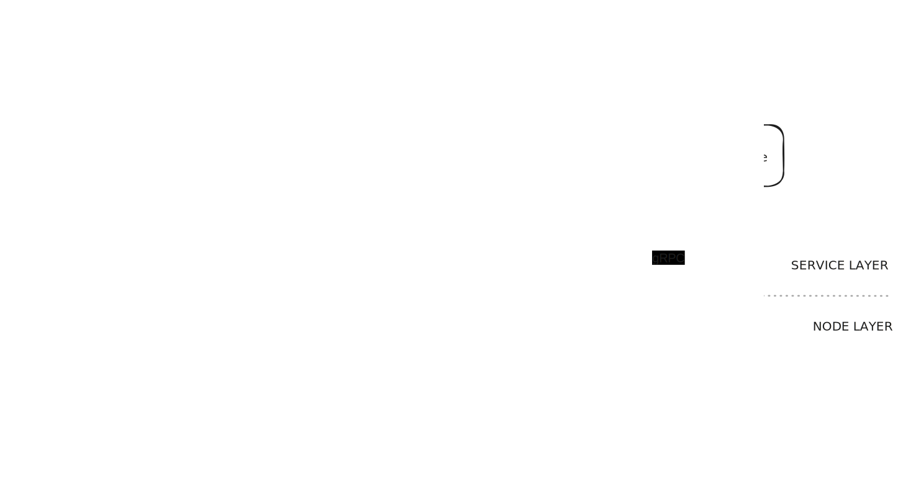
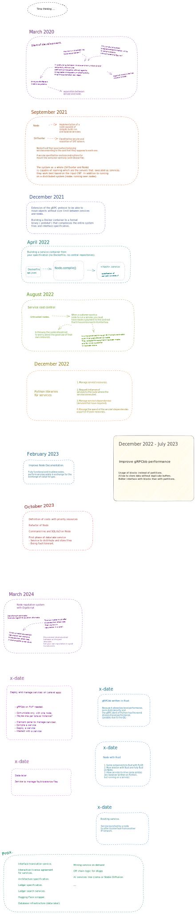

# CELAUT: A peer-to-peer architecture for software design and distribution

 

## Context
In 1970, the British mathematician John Horton Conway introduced a cellular automaton called "The Game of Life." A cellular automaton serves as a mathematical and computational model for a dynamic system that evolves in discrete steps.

The Game of Life suggests that, through a set of simple rules, complex structures can emerge. This system consists of a group of agents (or cells) that occupy a space and follow rules that dictate their interactions with other agents. In a way, this mirrors the evolution of a living ecosystem, constantly improving and optimizing processes without conscious intention.

This same principle can be applied to the capacity of competitive economic systems to enhance their processes. When a company explores new technologies to reduce costs, it does so not for the common good but to outperform rivals. Yet, unconsciously, it contributes to the common good. The market will determine whether the new approach to a task is more optimal or not.

Competition of ideas, processes, and methods is what allows us to improve our way of life. For instance, in industrial or logistical processes, if someone devises a more efficient method, they create a company to implement it. If it proves better than the traditional method, it gains a larger market share, surpassing the previous approach.

However, real-world evolution is slow to observe due to the time required for tangible results. Conversely, in simulated environments, new action proposals can be observed much faster, considering more options and allowing for the immediate application of the best approach.

The computer revolution of recent decades provides us with the ability to simulate and automate processes. A network of computers with these capabilities has been established, offering tremendous potential. Cutting-edge technologies such as artificial intelligence promise a significant improvement in our quality of life, primarily through their potential to automate tasks beyond previous imagination.

In a cellular automaton, the fewer and/or less complex the rules governing agent interactions, the broader the spectrum of complexity the automaton can achieve. In other words, more rules lead to greater limitations.

 

## Principles

1. Descentralization
2. Simplicity
3. Determinism

>In addition to these, the architecture is in line with the [Ergo Manifesto](https://ergoplatform.org/en/blog/2021-04-26-the-ergo-manifesto), despite not being limited to the use of this platform.

 

## Definition

*CELAUT is a set of simple rules for software design and distribution. It is based on two main elements: nodes and services.*

### Nodes

A node is a computer on the network that can find and communicate with other nodes. It has the ability to share, build, and orchestrate services between them.

#### Node responsabilities:

1. **Service Execution**: Handles service instance requests, balancing the load between running them 
locally or on its peer nodes. This ensures an efficient distribution of tasks and resources across the network, optimizing system performance.

2. **Communication Interface**: Provides a robust and flexible interface that enables the services that it executes to communicate seamlessly with it, ensuring efficient data exchange and coordination.

3. **Address and Token Provisioning**: Offers a streamlined process for obtaining the communication address and authentication token of a service required for interaction, enhancing security and accessibility.

4. **Dependency Management**: Takes care of ensuring that services have access to the addresses of their dependencies, irrespective of the node on which they are executed, promoting a smooth and efficient service ecosystem.

>An implementation of a node using Python3 (and progressively Rust): [Nodo](https://github.com/celaut-project/nodo)

 

### Services

A service is software container that performs a specific task, whose specification is found in a binary file. They follow the idea of a "black box" or a lambda function. Could be called "bots" too.

Generally, nodes are run as containers (isolated processes) or virtual machines, depending on how the node in question works with the service architecture, if it supports it.

>For example, a node with the architecture linux/arm64v8 can execute services with that architecture using Docker containers. If it wants to execute a windows/x86 service, it must execute it using a virtual machine. However, this is transparent to the services.

 

**This architecture allows services to focus on their functionality, without worrying about the underlying infrastructure. Nodes, for their part, can efficiently manage the execution of instances, without worrying about their usefulness.**

 

##  How a service is specified?

 

The specification of a service in CELAUT consists of three main components:

### Container | *BOX*
This component defines the environment in which the service will run, including the hardware and software requirements. It specifies the architecture, entry point, filesystem, and environment variables of the service.

### Interface | *API*
This component defines how the service can be interacted with, including the ports it listens on, the communication protocols it supports, and the methods it defines. It specifies the application protocol, the slots, and the cost function (optional).

### Network | *NET*
~~This component defines the database that the service can provide, including the class diagram and the consensus protocol (optional). It specifies the classes and the relation definitions.~~

  

The specification of a service is a key part of the CELAUT architecture, as it allows services to be deployed and executed in a consistent and predictable manner. 

It also allows for services to be shared and reused across the network, which can help to reduce development costs and improve the overall efficiency of the system.

 

The node will load the service from the binary and provide it with the resources it needs to run.

There is no single way to define a service.
For example, [Proto3 implementation](https://github.com/celaut-project/node-driver/blob/main/src/node_driver/gateway/protos/celaut.proto#L66) is one of many possible variations.

 

Not all nodes will accept all possible variations of a service specification.

>For example, node A understands a specific proto3 specification and one in JSON. Another node B understands the JSON specification and another in JSON+zip file system. Both nodes can transmit services of the specification they have in common, in this case, JSON.

 

## Why is this necessary

CELAUT intend to solve is precisely the separation between the “*how to solve a problem*” and the “*where and who solve it*”.

Take, for example, a trading bot.

>Trading bots are automated software programs that execute buy and sell orders in financial markets based on predefined algorithms. They are important as they can operate 24/7, react quickly to market changes, and remove emotional biases, enhancing efficiency and consistency in trading strategies.

 

In this context, if you want to use a trading bot right now, You will go to the web and can:

1. Look for a web service that will manage your asset portfolio, which has:
    1. Advantages:
        1. You don’t need to run the infrastructure yourself.
        2. You don’t need to configure anything.
    2. Disadvantages:
        1. You can’t attribute reputation to it because the developer of the web
        service is unable to prove that the system hasn’t changed (for example,
        when a bot has gained a large number of users, they might reduce
        its performance to encourage you to use a newer one).
        2. The developers of the web service can’t assure you that they aren’t
        misusing the data from your requests (in this case, the
        movements of your portfolio).
2. Search for a source code (on GitHub, etc.) that you can run on your PC (or in the cloud) on your own.
    1. Advantages:
        1. It’s deterministic, in the sense that (if it can’t connect to the
        internet) you’ll be sure that its behavior and/or performance won’t change in the future, because the developer can't modify the source that you previously downloaded.
        2. The developer of the service has no control over the data of your requests.
    2. Disadvantages:
        1. You need to possess equipment (infrastructure) capable of running the code.
        2. You have to deal with system configuration issues (which are often
        significant enough for an average user to opt for a web service).

In contra part of this two options, CELAUT allows to take the advangates of the two previous solutions without their disadvantages. There’s why:

- Infrastructure management is unnecessary, as the nodes handle it. There is no need to seek out a cloud provider.

- No configuration is required. The specification service covers how the container is built, its architecture, its network requirements, and its interface. Users do not need to be concerned about any of this.

- Service developers cannot control, modify, or extract data from the service. They do not control the nodes that distribute and run it. However, they may be incentivized to create it.

 

## Different types of role users on the system

As users, we can play three types of roles:

- Node maintainer (similar to someone maintaining a miner in a blockchain).
- Service developer. These can be run by anyone on any node (any compatible node, in terms of architecture, etc.).
- Users who launch services on nodes.

Therefore, the person maintaining a node (type 1 user) doesn’t concern themselves with whether it’s mining PoW, running a trading bot, analyzing a DNA sequence, or whatever the services it runs do. They simply execute the services that type 3 users request, in exchange for proof of payment (on a blockchain or whatever method of payment is accepted). The developer (type 2 user) only needs to send it to one or multiple nodes, and these will handle distributing the service among others and/or uploading it to a reputation system[¹],  so that users (or other services) know if use it and when and why to use it.

>This is a simple view of the system, by introducing more complexity the amount of possible user roles could also grow

[¹]: An implementation of a reputation system on the Ergo blockchain is [this](https://celaut-project.github.io/ergo-reputation-system).

 

## FAQ

### How do multiple clients make requests to a specific service?

Based on the architecture developed earlier, if a client wants to use a service, it requests the creation of an instance of it on a node. Therefore, if n clients want to use the service, n instances of it will be needed. In the end, an instance of a service, a container, is nothing more than an isolated thread. Therefore, the client/server paradigm is altered when talking about services on a trustless distributed system. Instead of one server serving multiple clients, a client requests the deployment of a service. In terms of performance, there should not be a big difference between one scheme and another, since the centralized server ends up executing n threads for n client requests. In distributed services, these threads are isolated (which can be a negative point regarding shared memory usage, but this is solved with some other patterns) and are distributed among the nodes in the network.

To create a web service that can be connected to a frontend in a browser, a new service is required to handle incoming requests from clients and deploy and use the classification service. This service, as shown in *Figure 118*, can be understood as a bridge between the "traditional web" and a distributed service network.

*__Figure 118__: Celaut service bridge to a common web pattern*

 

### Multiple instances cannot share dependencies

The nature of the network creates a hierarchy of service instances distributed across the nodes of the same. 
This means that when an instance (parent) requests an instance of another service (child or dependency), the latter will become dependent on the former, with the parent assuming the right to decide when the child should be stopped and the responsibility for its resource consumption (in case a node tracks the consumption of each instance, it must take into account that of its dependencies). 

In this way, if the parent is stopped, the node where its child is running can stop it. If it were not so, a node would not know which instances are in a 'zombie' state since none of its clients (parent instances) would be responsible.

 

### Why include the entire filesystem in the specification of a service?

The specification of a service must define it completely and comprehensively to avoid redundancy among different services. 

This can lead to problems such as the size of the specification, but these problems can be solved in a higher abstraction layer, such as the 
[gRPCbb protocol](https://github.com/celaut-project/grpc-bb#using-blocks-buffer-containers)
does.

>Using Dockerfiles to define a service would not be possible to verify the authenticity of the container, since the Dockerfile defines how to build the container and, generally, are download instructions from central repositories, and they can change the result over the time. A node can accept a specification that uses Dockerfiles, but it would not be in line with the principles of the architecture.

 

### Hash Algorithm Identification

To avoid collisions when identifying different hash algorithms, they are identified by applying their own algorithm to an empty input, that is, an empty bit string. 

For example:
- **Sha2562-256 utf-8**: e3b0c44298fc1c149afbf4c8996fb92427ae41e4649b934ca495991b7852b855

- **Sha3-256 uft-8**: a7ffc6f8bf1ed76651c14756a061d662f580ff4de43b49fa82d80a4b80f8434a

- **Shake- utf-8 of 256 bits**: 46b9dd2b0ba88d13233b3feb743eeb243fcd52ea62b81b82b50c27646ed5762f

- **Sha2562-256 utf-8 over Sha256-256 utf-8**: cd372fb85148700fa88095e3492d3f9f5beb43e555e5ff26d95f5a6adc36f8e6

 

In this way, the word "*CELAUT*" would be:
- Sha2562-256 utf-8:

    - type: e3b0c44298fc1c149afbf4c8996fb92427ae41e4649b934ca495991b7852b855
    - value: d7f901be75b36a2ccef2fcc61f9c0665af4155ccee1eda8c4afa1a4f994e825c 
    
- Sha3-256 utf-8:
    - type: a7ffc6f8bf1ed76651c14756a061d662f580ff4de43b49fa82d80a4b80f8434a
    - value: de1a91208f7c6d320cbc50e45952fe40cb18a949f8a4daae0f8428fc60523f09

- Shake-256 utf-8 of 256 bits:
    - type: 46b9dd2b0ba88d13233b3feb743eeb243fcd52ea62b81b82b50c27646ed5762f
    - value: d10ca3f8a2ab79a8b841876780d232770e70a22cbcc8769a0a1a44194702ee7c

 

To avoid collisions with similar algorithms 
(or variations of one, is the same) 
double algorithm identification could be used, for example:
- Sha2562-256 utf-8 over Sha256-256 utf-8:

    - type: cd372fb85148700fa88095e3492d3f9f5beb43e555e5ff26d95f5a6adc36f8e6
    - value: 22bcde154d5f214fe34a5e2b862c0b5aee07d04f62b293b749727ce4b2bea9ad 

 

In this way, no centralized registry is required to agree on which identifier corresponds to a specific algorithm.

>In the same way as in the case described in the question regarding the file system, a node is not required to use this hash identification format. This solution is presented because it is in line with the CELAUT principles.

Other way to solve the problem could be 
[multihash from Protocol Labs](https://github.com/multiformats/multihash#format).
But it needs to have a consensus to say what algorithms has what identifier codes.

### How does CELAUT's peer-to-peer network architecture relate to orchestrators like Kubernetes or  Apache Mesos ?

The primary distinction lies in the hierarchical structure of both 
[Kubernetes](https://kubernetes.io/es/docs/concepts/architecture/nodes/)  and 
[Apache Mesos](https://mesos.apache.org/documentation/latest/architecture/)
, where a single master node oversees a collection of subordinate nodes, or minions. 
In contrast, CELAUT employs a decentralized approach, where no individual node holds authority over another, fostering a trustless environment that can support a vast and globally distributed computational network.

CELAUT offers several integration and utilization possibilities with existing systems:

- Evolving them so that the node operates as a master node in these systems and treats the other peers as subordinate minions (even if they are not, meaning compensating them).

- Operating as standalone services within the distributed network, assuming responsibility for load balancing and coordinating other child services in a centralized fashion. This role can prove beneficial for applications requiring centralized control and orchestration.

- Employing them within traditional centralized server environments, recognizing that CELAUT's inherent trustlessness may not be essential when all nodes are under the control of a single organization. In such scenarios, the master node assumes the responsibility of connecting to external nodes via the CELAUT architecture.

 
 

## Links

[Proof of Concept: CELAUT over IPFS, Feb '21](https://discuss.ipfs.tech/t/proof-of-concept-interplanetary-service-system/10245)

[Ergo-forum conversation, Aug '23](https://www.ergoforum.org/t/artifical-economic-intelligence-on-ergo-blockchain/4429/2)

>IPFS or Ergo are not platforms on which the architecture is based, although both are aligned with the CELAUT principles.

 

## Roadmap

