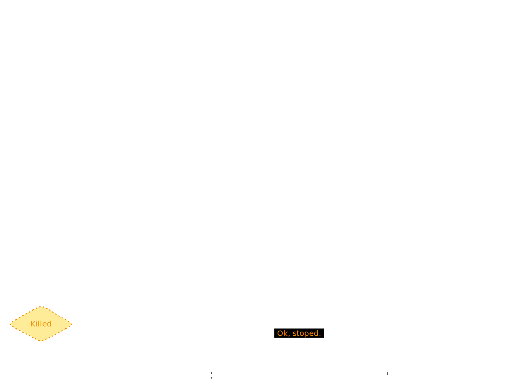

[*<-- Back to main page*](../README.md#uml-diagrams)

### Sequence diagram of the execution of a service instance

*__Figure e29__: Sequence diagram of the execution of a service instance*

 

The agents that participate in the previous sequence diagram (Figure e29) are as follows:

- Main service: This is the instance of the service that requests to instantiate another service on its node.

- Node: This is the node to which the Main service requests the generation of the new instance.

- Dependency: This is the new instance that the Main service wanted to use.

 

The following interactions occur during the sequence:

1. The instance of the Main service sends the specification of another service to its node using the *StartService()* method. This assumes that the node will take care of executing an instance of this service and will return the address of the new instance, as well as the relevant token.

2. The node, after receives the request from the Main service, stores the full specification or, it it's already stored, stops the request stream (to only take the hash of the requested service).
    
3. The node instantiates the requested service, loading the configuration (the *__config __* file in its root) and executing its entry point.

4. The dependency starts with the execution described in the entrypoint of its specification.

5. The node obtains the address of the container's instance and calculates the corresponding token, the token will be a secret identifier of the new service instance and depends on the node implementation. ~~The node stores the instance in the registry as an internal instance and the service that requested it as its parent.~~ Finally, it returns the address and token of the instance to the Main service.
    
6. The Main service, the instance requester, uses the dependency via the address that the node has provided it.
    
7. The Main service decides to stop the dependency, so it executes the *StopService()* method of the node, sending it the token of the dependency.

8. The node stops the container of the dependency and removes it from the registry.

>The *StartService()* and *StopService()* methods are reference methods, but can vary between implementations. The node interface, used by clients and local services (services that run the node) to make requests and control resources and dependencies, is provided by the node to new clients or local services.

>The *__ config __* file indicates the configuration of each service (environment variables, node interface, etc.), which depends on each service, since its schema is indicated in the specification of each one. The node may have the ability to write in one or more schemas, and if it is not compatible, it can either decide not to instantiate the service or use a translation service.